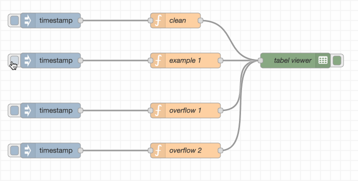
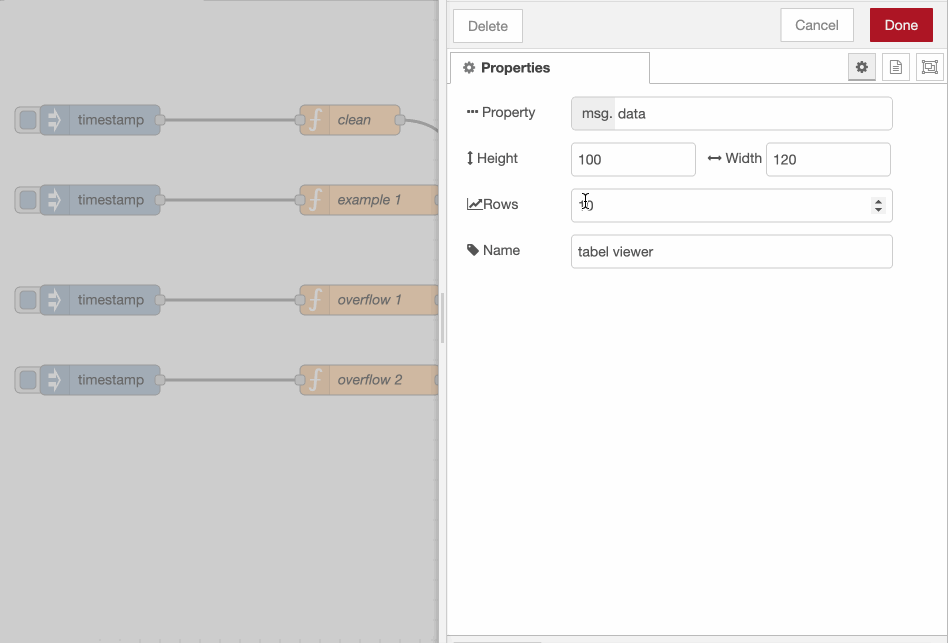

# View Tabular Data on Flow Screen

A table viewer node which can preview the data in a tabular fasion. 



This project is inspired by following two projects.

[data-view](https://github.com/mblackstock/node-red-contrib-data-view)

[image-output](https://github.com/rikukissa/node-red-contrib-image-output)

## Input

An arry of arrays, for exampe:

```javascript
let data = [
    ["id","Stock","Price"],
    [0, "TSLA", 222.22],
    [0, "AAPL", 144.44]];
```

On flow editor, user can taggle the active button. If active is on, it will show a table under the node. 

User can adjust the width and height of the table size. And also can scroll up-down or left-right if the table size is larger than the area. 


